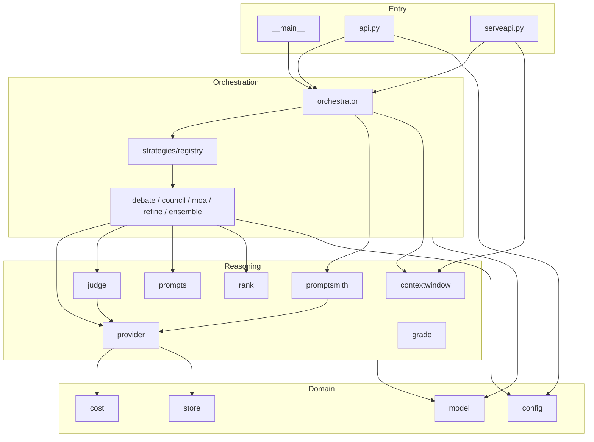
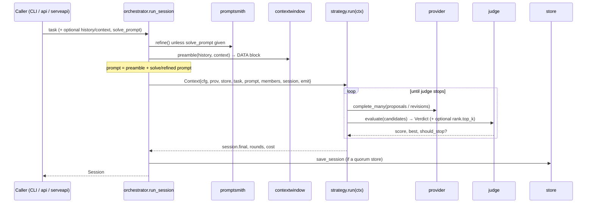
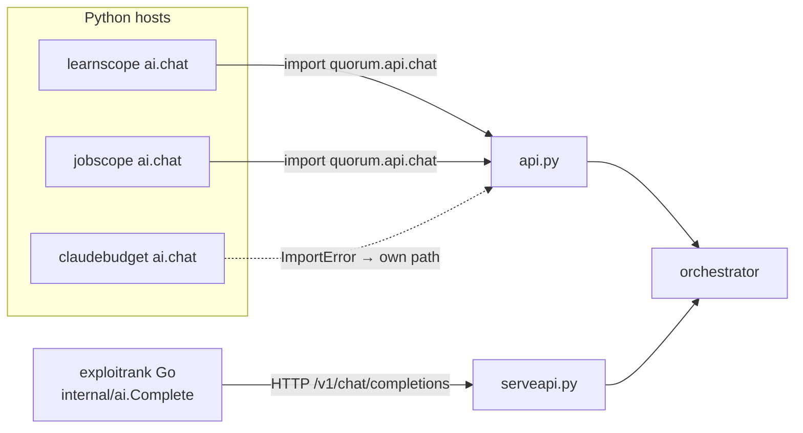

# quorum — architecture & code map

A living map of the codebase: what each module does, how a deliberation flows,
where the extension points are, and how the design should evolve as features are
added. Keep this current when you add or move a module.

---

## 1. What quorum is (and the rules it lives by)

quorum turns a prompt into a *deliberated* answer: several models propose,
critique, and refine until a judge says "good enough". It is also the shared AI
backend for the sibling tools (claudebudget, jobscope, learnscope, exploitrank).

Four principles constrain every design decision here:

- **Stateless engine.** quorum holds no cross-call memory. Callers own state
  (conversation history, corpora) and pass it in per call. This keeps the engine
  pure and trivially testable.
- **AI-optional everywhere it embeds.** When quorum is the backend for another
  tool, it is an *optional* enrichment layer — off by default, and the host
  degrades to its own deterministic path if quorum is absent/disabled.
- **Lean dependencies.** Runtime dep is PyYAML only; HTTP is stdlib `urllib`;
  concurrency is `concurrent.futures`. Optional extras (`tiktoken`) never gate
  core behavior.
- **Offline-testable.** A built-in `mock` provider answers deterministically, so
  the whole engine — every strategy, the judge, retrieval, the API — runs with no
  network and no keys. `selftest` and most of pytest rely on it.

> Adding anything? It must keep all four true: default-off, mock-supported,
> no new hard dep, and covered by a selftest check + a pytest.

---

## 2. Module map

Grouped by layer (all under `quorum/quorum/`).

### Entry points — turn an external request into a `run_session`
| Module | Responsibility | Key symbols |
|---|---|---|
| `__main__.py` | CLI (argparse); lazy-imports feature modules | `cmd_run/chat/bench/serve/...` |
| `api.py` | **Embed API** — drop-in for a host tool's `ai.chat` | `enabled`, `build_config`, `deliberate`, `chat` |
| `serveapi.py` | **OpenAI-compatible HTTP server** (`serve --api`) for non-Python hosts | `complete_chat`, `make_server`, `run`, `_split` |

### Orchestration — run one deliberation end to end
| Module | Responsibility | Key symbols |
|---|---|---|
| `orchestrator.py` | The pipeline: promptsmith → context preamble → strategy → persist | `run_session(...)` |
| `strategies/__init__.py` | Strategy **registry** + entry-point discovery + shared `Context` | `Context`, `get`, `available` |
| `strategies/{debate,council,moa,refine,ensemble}.py` | The deliberation algorithms | each exposes `run(ctx)` |

### Reasoning services — the moving parts a strategy composes
| Module | Responsibility | Key symbols |
|---|---|---|
| `provider.py` | All model I/O: mock-or-HTTP, retry/backoff, **fallbacks**, `response_format`, fan-out | `Provider`, `Completion`, `MockResponder` |
| `judge.py` | Score a round vs a rubric; decide when to stop | `evaluate`, `should_stop`, `consensus_reached` |
| `prompts.py` | System prompts + message builders (framed DATA-not-instructions) | `propose`, `revise`, `challenge`, `synthesize`, `aggregate`, ... |
| `promptsmith.py` | Phase-1 OPRO prompt refinement + few-shot bootstrap | `refine`, `_exemplars` |
| `rank.py` | Rank candidates from peer reviews; lexical doc select | `consensus_order`, `top_k_indices`, `select` |
| `contextwindow.py` | Pack caller history + grounding docs into a DATA-framed preamble | `ContextDoc`, `pack`, `select`, `preamble` |
| `grade.py` | Reference-based grading (numeric/deterministic or AI grader) | `numeric_match`, `extract_gold`, `grade` |

### Domain & data
| Module | Responsibility | Key symbols |
|---|---|---|
| `model.py` | Core dataclasses + id/vendor helpers | `ModelSpec`, `Turn`, `Verdict`, `Round`, `Session` |
| `config.py` | `DEFAULT_CONFIG`, deep-merge loader, `.env`, accessors | `load_config`, `member_specs`, `role_spec`, `api_key` |
| `store.py` | SQLite: sessions / ai_cache / bench / runs | `Store`, `save_session`, `ai_cache_*`, `top_sessions` |
| `cost.py` | Token counting (optional tiktoken) + pricing/budget | `count_tokens`, `price`, `over_budget` |

### Reporting & scaffolding
| Module | Responsibility |
|---|---|
| `bench.py` | Run/aggregate a strategy comparison over a task set |
| `render.py` | Self-contained offline HTML dashboard |
| `format.py` | Plain-text transcript for `run`/`show` |
| `exporter.py` | Export a session as JSON / CSV / Markdown |
| `serve.py` | Serve the dashboard over local HTTP |
| `scaffold.py` | `init` — non-destructive config + data dir |
| `selftest.py` | ~90 offline checks; the extensibility contract in executable form |

---

## 3. Module dependencies

Rule of thumb: **arrows point down.** Reasoning services never import
strategies; the domain layer (`model`, `config`, `cost`, `store`) imports nothing
above it. Keep it that way — it is what makes the mock provider able to stand in
for the whole network boundary.

---

## 4. A deliberation, end to end

The **only** network boundary is `provider`. Swap in `MockResponder` and every
box above runs offline and deterministically.

---

## 5. Extension points (how to add things today)

- **A new strategy** — drop `strategies/yourstrat.py` exposing `run(ctx)`, add it
  to `_BUILTIN`, or ship it out-of-tree via the `quorum.strategies` entry-point
  group. The registry discovers installed plugins automatically.
- **A grounding/context source** — the caller (host tool) builds `ContextDoc`s
  and passes them to `api.chat(..., context=[...])` or the serveapi `context`
  field. Retrieval that a tool owns (e.g. exploitrank's CVE/actor linker) lives in
  the tool; `contextwindow.select` is the generic lexical fallback.
- **A provider** — any OpenAI-compatible endpoint is just a `providers:` profile
  in config. `mock` is the offline one. (A non-OpenAI backend is a bigger change —
  see §8.)
- **A CLI command** — add `cmd_x` + a subparser in `__main__.py` (lazy-import the
  feature module to keep startup light).

---

## 6. Integration surface (how the tools plug in)

- **Python hosts** delegate at the top of their `ai.chat` to `quorum.api.chat`
  (guarded by `ImportError` + an `enabled` gate), forwarding `history`/`context`.
  If quorum is absent/disabled they fall back to their single-model path.
- **Non-Python hosts** (exploitrank) point an OpenAI-compatible client at
  `serve --api`; the request's `model` field selects the strategy, and an optional
  `context` field carries grounding docs.

---

## 7. Configuration model

One `DEFAULT_CONFIG` dict, deep-merged with the user's `config.yaml`. Secrets stay
in env vars named by each provider profile. Feature flags are **default-off**, so
a fresh config behaves like the pre-feature engine. Current sections: `council`,
`providers`, `run`, `promptsmith`, `judge`, `cost`, `context`, `output`.

---

## 8. Modularity assessment — evolving as features land

### Already modular (keep leaning on these)
- **Strategy registry + entry points** — the model to copy for other pluggable
  concerns.
- **Provider = the single network seam** — makes the whole engine offline-testable.
- **Stateless core + caller-owned state** — context/history are inputs, not
  engine memory.
- **Executable contract** — `selftest` + the mock provider force every feature to
  be offline-verifiable.

### Growing pains & recommended refactors
Ordered by payoff as more features arrive. Each is optional and independently
shippable; none changes behavior.

| # | Smell (today) | Move | Files | Priority |
|---|---|---|---|---|
| 1 | `run.*` is accreting knobs (`fallbacks`, `top_k`, `devils_advocate`, `moa_layers`, stopping, ...); every strategy re-parses `run.get(...)` | Resolve a typed **`RunOptions`** once in the orchestrator, hang it on `Context`; strategies read fields, not the dict | `strategies/__init__.py`, `orchestrator.py`, all `strategies/*` | **High** |
| 2 | The orchestrator hard-codes its stages (promptsmith → context → strategy → persist); new stages (retrieval, safety/PII filter, post-processing) mean editing `run_session` | A small **pre/post hook pipeline** so stages register instead of being inlined | `orchestrator.py` | **High** |
| 3 | "Score/rank text" logic is split four ways | A **`scoring/` package** with a common scorer protocol + registry (lexical, rubric-LLM, reference-numeric, embedding-later); `judge`/`grade` become evaluators, `rank`/`contextwindow.select` share the scorers | `judge.py`, `grade.py`, `rank.py`, `contextwindow.py` | Medium |
| 4 | `api.build_config` and serveapi request-mapping both translate *external → quorum* | One **`adapters` module** with a host-config mapper + a request mapper, reused by both surfaces | `api.py`, `serveapi.py` | Medium |
| 5 | `prompts.py` is a flat grab-bag; strategy-specific builders (e.g. `challenge`) bloat it | Co-locate builders with their strategy (or a `prompts/` package by role); keep the shared DATA/LLM01 framing in one helper | `prompts.py`, `strategies/*` | Medium |
| 6 | `provider.py` bundles routing + transport (retry/fallback/json-mode) + accounting | Split a **transport** layer from a `Provider` protocol so alternate backends (embeddings, streaming, optional litellm) register like strategies | `provider.py` | Low* |
| 7 | No config validation — a mistyped key silently no-ops | A light **known-keys validator** that warns on unknown paths | `config.py` | Low |
| 8 | `emit` is an ad-hoc string logger | A minimal structured **event/hook** interface for observability as flows deepen | `orchestrator.py`, `strategies/*` | Low |

\* Low unless a non-OpenAI or multi-backend provider lands on the roadmap — then #6 jumps to High.

### Suggested near-term order
Do **#1 (RunOptions)** and **#2 (hook pipeline)** first: together they are the
biggest leverage for "add more features" because most new features are either a
new knob (→ #1) or a new stage (→ #2). Then **#3 (scoring package)** the next time
retrieval/eval grows, and **#4 (adapters)** the next time a new host integrates.

---

## 9. The "add a feature" checklist

1. **Default-off** config in `DEFAULT_CONFIG` + `config.example.yaml`.
2. **Mock support** — the `mock` provider must exercise it offline.
3. **A `selftest` check** and a **pytest** (offline, deterministic).
4. **No new hard dependency** (optional extras only, guarded).
5. **Respect the layers** — reasoning services don't import strategies; domain
   imports nothing above it.
6. If it touches the embed path, keep `api.chat` **signature-compatible** so the
   sibling tools' delegation keeps working.
